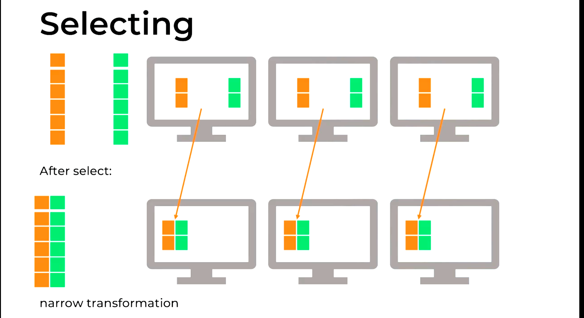

# Title

## Pre-watch questions
* How do you operate on columns?
* What are expressions?

## Chunk 1
(only write concepts)

columns
narrow transfomration
selecting
projection

## Chunk 1 converted
- the `3 main points`
- the `plain English explanation`
- `why it matters`
- `one example`

# 3 main points
1. select/projection - we can select specific columns from dataframes and this will create a new df with those columns. This is a NARROW transformation
2. expressions - with expressions you can transform columns by doing arithmatic directly for example. You can also filter data. There are many ways to do the same thing there are various expression syntaxes
3. You can also add more rows to dataframes through unioning although they need to have same schema

# plain english
you can select certain columns in df remember this will create a new one. You can do operations on columns through expressions. 

This can be 
1. creating new columns
2. renaming existing ones
3. transforming columns

You can also apply filters

You can also do operations on rows like adding new rows through unioning however the data must have same schema.

## Chunk 1 compressed
Concept: Expressions are powerful tools to do column wide transformations on data.
Why it matters: We can use this to express the data in many ways
Example: You want to find the best movie to watch you can create new column for profit and use many financial columns to come up with it. You can then filter by profit and by genre and by rating.
One confusion: Remember that doing any expression on a dataframe will not change the existing dataframe since they are immutable but instead create a new one.
